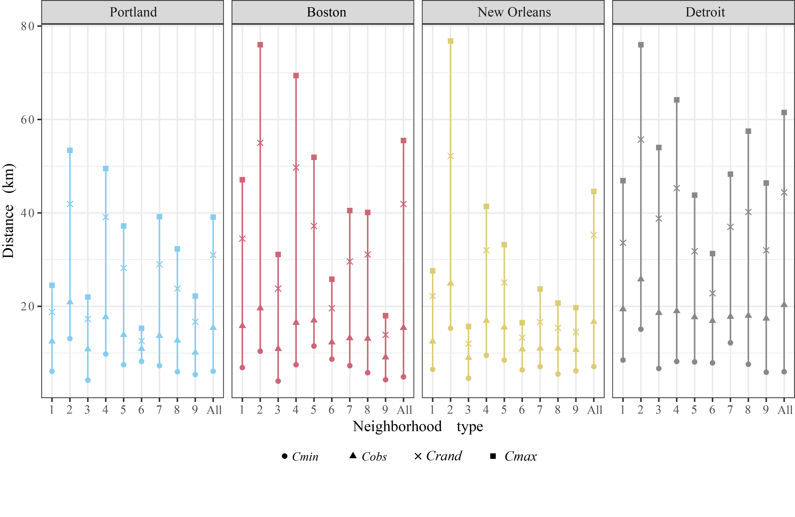

---
<!--
##### Download

+ [Paper](paper1.pdf)
+ [Online appendix](appendix1.pdf)
+ [Code and data](https://github.com/pmichaillat/feru)

-->

##### Abstract

Excess commuting reflects a cits overall commuting efficiency by quantifying the proportion of non-optimal commute that would be avoided if resident workers could freely swap houses or jobs in a given urban form. This framework has been widely used to evaluate urban land use and transportation policy decision-makings. One major methodological limitation in the excess commuting literature is that most existing studies establish on an oversimplified assumption of homogeneous resident workers/jobs, which neglects the complexity of residential (and employment) location choices. To fill this gap, this research develops a methodology to measure excess commuting across worker subgroups differentiated by residential neighborhood type, which captures the comprehensive socioeconomic profiles of workers defined based on multiple attributes. Based on a cross-sectional study of Portland, Boston, New Orleans, and Detroit, it is found that the traditional method overestimates the commuting benchmarks and causes biased evaluation of commuting efficiency performance. Moreover, this research reveals significant disparities in excess commuting across different neighborhood types and identifies three representative subgroups of distinct excess commuting patterns, which are the traditional suburban subgroup, new starts subgroup, and socioeconomically disadvantaged subgroup. With this proposed methodology, more effective and heterogeneous policies targeting different population subgroups could be developed.

---

##### Figure 3: Comparisons of commuting benchmarks

---

##### Citation

Jing, Y., Hu, Y., & Niedzielski, M. A. (2023). Neighborhood divides: Where you live matters for commuting and its efficiency. Cities, 132, 104091. https://doi.org/10.1016/j.cities.2022.104091

---

