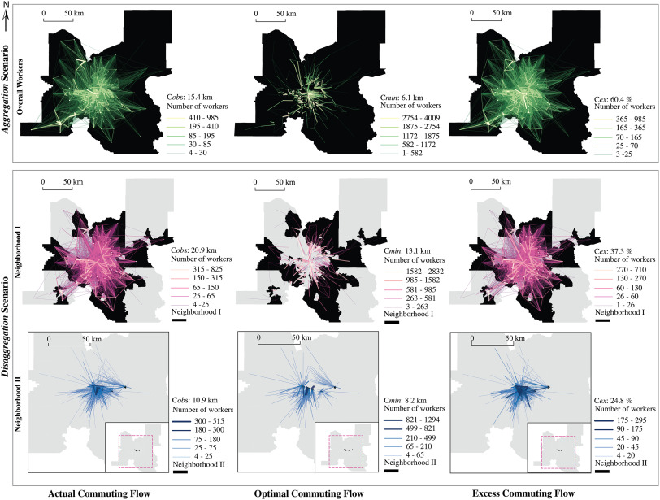

---

##### Abstract

Excess commuting measures commuting efficiency by comparing the actual commute with minimum commute for a
given urban form (Hu and Li, 2021). Despite recent methodological advances, research gaps still exist. Calculating
the minimum commute requires an optimization process of swapping residences/jobs among workers (White, 1988),
and many commuter disaggregation approaches have been proposed for more meaningful estimates. This includes
the disaggregation by occupation type, income, age, and other socioeconomic characteristics or travel behaviors (e.g.,
Horner et al., 2015 and the references therein; Schleith et al., 2016; Hu and Li, 2021). Nevertheless, most of these
disaggregation analyses are only focused on a single socioeconomic class, which alone could be ineffective to capture
the complexity of individuals’ residential (and employment) location choices. Another gap is about the resulting
statistic and its demonstration. As a global indicator, excess commuting is largely reported as a single statistic
concerning system-wide commuting efficiency, thus failing to capture and visualize spatial patterns. This research
aims to fill these gaps. Specifically, we stratify commuters into distinct subgroups by residential neighborhood types
using multiple socioeconomic variables related to residential and employment characteristics and then measure excess
commuting across subgroups. Moreover, we create and geovisualize commuting networks associated with the actual,
optimal, and excess commuter flow patterns to better reveal the spatial interaction patterns between locations and
the disparities across commuter subgroups.

---

##### Figure 1: Visualizing excess commuting

---

##### Citation

Jing, Y., & Hu, Y. (2022). The unequal commuting efficiency: A visual analytics approach. Journal of Transport Geography, 100, 103328. https://doi.org/10.1016/j.jtrangeo.2022.103328

